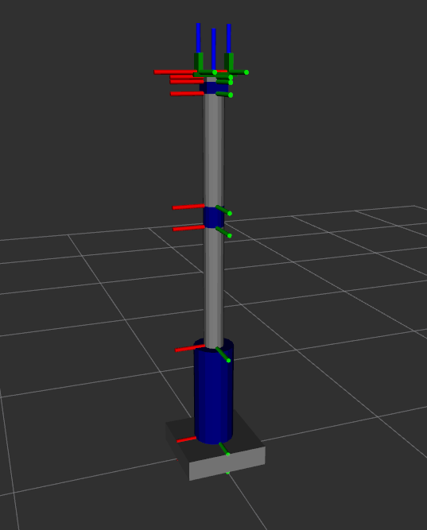

## 4-ROS2ArmMoveit: 建立 Robotic Arm 并使用 Moveit Cpp API

### Project Overview

1. my_robot_description: 用于描述机械臂的urdf 模型, 包括 controller.xacro 关键信息
2. my_robot_moveit_config: 由 moveit GUI 工具包生成的内一个工程，此处已经在构建完 my_robot_description 工程后配置好，可直接搬运使用，无须编辑。
3. my_robot_interface: 包含需要用到的一个自定义interface
4. my_robot_commander_cpp: 包含了使用 moveit cpp api 开发的若干的交互接口和subscriber，用于控制机械臂：<br>
    Commander::OpenGripperCallback<br>
    Commander::JointCmdCallback<br>
    Commander::PoseCmdCallback<br>
5. my_robot_bringup: 用于启动机械臂的bringup 包

### Demo 使用方法
提供一个简单的demo可以快速测试工程，在安装了 ROS2 jazzy 和 moveit 的环境中。(建议 Ubuntu 22.04 )<br>
安装 ROS2 jazzy: https://www.youtube.com/watch?v=dY8JxldcuqA&pp=0gcJCf0Ao7VqN5tD<br>
安装 moveit:（待完善）<br>
编译工程：<br>
``` cd ROSControllerLearningCase/4-ROS2ArmMoveit ```<br>
``` colcon build ```<br>
``` source install/setup.bash ```<br>
由 launch file 启动：<br>
``` ros2 launch my_robot_bringup my_robot.launch.xml ```<br>
另启一个terminal,启动自己编写的 commander 节点：<br>
``` ros2 run my_robot_commander_cpp commander ```<br>
再另启一个terminal,控制机械臂：<br>
    1）控制 gripper :<br>
    ```ros2 topic pub -1 /open_gripper example_interfaces/msg/Bool "{data: true}"```<br>
    2）使用 joint_cmd 话题控制机械臂关节运动:<br>
    ```ros2 topic pub -1 /joint_cmd example_interfaces/msg/Float64MultiArray "{data: [0.5, 0.5, 0.5, 0.5, 0.1, 0.1]}"```<br>
    3）使用 pose_cmd 话题控制机械臂末端执行器运动:<br>
    ```ros2 topic pub -1 /pose_cmd my_robot_interfaces/msg/PoseCommand "{x: 0.7, y: 0.0, z: 0.4, roll: 3.14, pitch: 0.0, yaw: 0.0, cartesian_path: False}"```<br>
控制结果可以看到：<br>
初始：<br>
<br>
控制命令挂起后：<br>
<br>

### Details
1. 如果要从头自己参考教程配置 moveit 工程（不确定是否只有我遇见这个问题），建议在配置完工程后，检查 moveit_controllers.yml 中如 type: FollowJointTrajectory 类的 controller 配置，确保其中包含了 action_ns: follow_joint_trajectory 关键字信息。<br>
否则可能导致moveit 在启动时，无法找到对应的 controller 启动信息，使得 configure过程失败，后续会有连串错误无法控制相应控件，该错误的提示信息为：
```
[move_group-3] [ERROR] [1758807803.282355251] [move_group.moveit.moveit.plugins.simple_controller_manager]: No action namespace specified for controller `gripper_controller` through parameter `moveit_simple_controller_manager.gripper_controller.action_ns`
```
